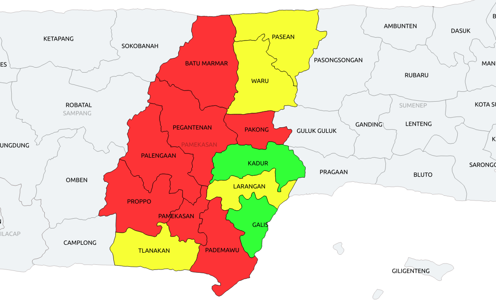

```{r setup, include=FALSE}
knitr::opts_chunk$set(echo = FALSE)
```

```{r echo=FALSE, message=FALSE}
library(dplyr)
library(tidyverse)
library(cluster)
library(factoextra)
library(gridExtra)
library(leaflet)
library(jsonlite)
library(maps)
library(knitr)
```

```{r echo=FALSE, message=FALSE, results='asis'}
#1 load data covid-19 di kab Pamekasan
data <- read.csv('data/pamekasan.csv')
kable(data)
```

### Statistik Data Covid-19 Kabupaten Pamekasan
```{r echo=FALSE}
#2 ambil data numerik
new_data <- data[,-1]
summary(new_data)
```
### Jarak Masing-masing Data

```{r echo=FALSE, message=FALSE}
#3 hitung jarak dari masing-masing data
distance <- get_dist(new_data)
distance
fviz_dist(distance, gradient=list(low="green",mid="white",high="red"))
```

### Klastering Data Covid-19 Kab. Pamekasan
```{r echo=FALSE, message=FALSE}
#4 membuat klasterinf menjadi 2 kelompok
set.seed(8953)
klaster <- kmeans(new_data, centers=3, nstart=25)
klaster
```

```{r echo=FALSE, message=FALSE}
#5 Membuat data frame untuk klaster
k = data.frame(klaster$cluster)
print(k)
fviz_cluster(klaster, data = new_data)
```

### Visualisasi Data Covid-19
